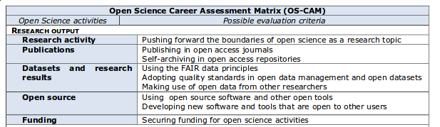
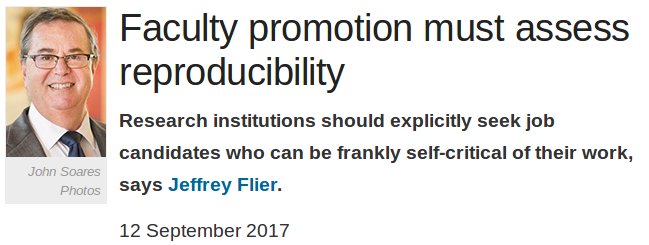
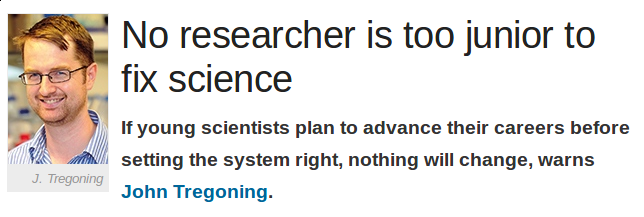

## An early career researcher's view on modern and open scholarship

```
Laurent Gatto                      Computational Proteomics Unit
https://lgatto.github.io           University of Cambridge
lg390@cam.ac.uk                    @lgatt0
```

* Slides: http://bit.ly/20170925OpenScienceEPFL
* Blog post: https://lgatto.github.io/EPFL-open-science/
* GitHub repo: http://github.com/lgatto/2017_09_25_OpenScience_EPFL

## Licence

These slides are available under a creative common
[CC-BY license](http://creativecommons.org/licenses/by/4.0/). You are
free to share (copy and redistribute the material in any medium or
format) and adapt (remix, transform, and build upon the material) for
any purpose, even commercially.


## Introduction

* Early Career researchers (ECR) - **we**
* Open is a gateway to better research
* Open Research/Science

## Who?

* Laurent Gatto - https://lgatto.github.io/
* ECR, non-established research staff, PI
* reproducible research, computational research, data, research software 
* Open scholar

## 

* What is open research
* Open vs close?
* Why isn't it open?
* Go open!
* What can we do?
* What can institutions do?
* Inclusivity!
* Conclusions


## What is open research?

Any research output should be

* free to access (read)
* free to use/re-use/mine
* free to disseminate (publish)

And

* inclusive

## Open vs. closed?

Mertonian norms of Science (1942)

* **universalism**, **communalism**, **disinterestedness**, **organised scepticism**

Are these imperatives in line with current practice?

## 

[](https://genomebiology.biomedcentral.com/articles/10.1186/s13059-015-0669-2)

## Open is a gateway to more trustworthy research

- Open research is research that enables reproducible and repeatable
  research.
- Open research is transparent and honest research.
- Open research is research that we can build upon.

**Open is better, and we should always aim for the better, not the worse.**

## But then...

> Why would anyone not want to do open research?

## Why isn't it open?

> If *research is the by-product of researchers getting promoted*
> (David Barron), then shouldn't we, early career researchers (ECRs),
> focus on promotion and being docile academic citizens rather than
> aiming for the more noble cause of pursuing research to understand
> the world that surrounds us, and disseminate our findings using
> modern channels?

## 

Barriers are not technological, but rather socio-cultural and
political.

- Systemic control and inertia
- Vested interests by people in charge 
- Abuse of power dynamics
- (Perceived) fear of being scooped
- (Perceived) fear of not being credited
- (Perceived) fear of errors and public humiliation, risk for reputation
- (Perceived) fear of information overload
- (Perceived) fear of becoming less competitive in a over-competitive market!
- ...

## Go OPEN! 

Open science/research is particularly important for ECRs. Open
research practices are here, and won't go away. It is clear that they
will increase in the near future. If *you*, as an ECR, want to be a
competitive researcher in the coming years (and you'll need to be),
you'll need to be well versed in open research practices. 

## Funders' requirements

- CC-BY open access publication (golden or green) with limited embargo
  period. In the UK, Wellcome Trust and all RCUK funders.
- Requirement for a data management plan
  (see [here](https://riojournal.com/articles.php?id=11624) for one of
  mine)
- Open data mandatory for H2020 grants and many national applications.
- The Wellcome Trust recently
  [expanded it's data management plan](https://wellcome.ac.uk/news/our-new-policy-sharing-research-data-what-it-means-you) to
  any research outputs (software, antibodies, cell lines, ...) (July 2017).

## Acceptance of open practice: pre-prints

- [Wellcome Trust](https://wellcome.ac.uk/news/we-now-accept-preprints-grant-applications) (Jan 2017) and the [Medical Research Council (MRC)](https://www.mrc.ac.uk/research/policies-and-guidance-for-researchers/preprints/) (April 2017) accept pre-prints in grant applications.
- NIH [encourages submission of pre-prints](https://grants.nih.gov/grants/guide/notice-files/NOT-OD-17-050.html) and cite them (March 2017).

## Open science evaluation criteria (1)

The EU's
[Evaluation of Research Careers fully acknowledging Open Science Practice](https://cdn1.euraxess.org/sites/default/files/policy_library/os-rewards-wgreport-final_integrated_0.pdf) defines an Open Science Career Assessment Matrix (OS-CAM):




## Open science evaluation criteria (2)

[Reproducibility and open science are starting to matter in tenure and promotion](https://cos.io/blog/are-reproducibility-and-open-science-starting-matter-tenure-and-promotion-review/) July
14th, 2017, Brian Nosek

> In any case, my experience with **promotion review requests** this
> summer suggests that change is occurring, particularly in assigning
> **scholarly value to open science** contributions and behavior, and it’s
> great to see.

## More citations

* Tennant JP, Waldner F, Jacques DC et al. [*The academic, economic and societal impacts of Open Access: an evidence-based review*](https://f1000research.com/articles/5-632/)
* Erin C McKiernan et al. [*Point of View: How open science helps researchers succeed*](https://elifesciences.org/articles/16800)
* Piwowar HA, Vision TJ. (2013)
[*Data reuse and the open data citation advantage*](https://peerj.com/articles/175/)

##  {.fullpage}


##  {.fullpage}


##  {.fullpage}


## Reproducible research

[](https://www.nature.com/news/faculty-promotion-must-assess-reproducibility-1.22596)

## We still need more

But, let's face it, in practice, it is currently still relatively easy
to brush over many of these requirements. In addition, the incentives
are still inconsequential compared to the (perceived) risks. Maybe we
need more threads when not being open.

## What can we do?

## Build openness at the core your research

* Many aspects of open research, and arguable the most important ones, can't be implemented as an afterthought.
* [Open Research Pilot Project](http://osc.cam.ac.uk/open-research/open-research-pilot-project) with the Wellcome Trust and OSC in Cambridge
* *SpatialMap*: sharing data - [GitHub repository](https://github.com/SpatialMap/SpatialMapDev) - [Grant proposal blog](https://lgatto.github.io/spatialmap-proposal/)


## Promoting open research through peer review

* Accept sound/valid research and provide constructive comments

and hence

* Focus firstly on the validity of the research by inspecting the
  data, software and method. If the methods and/or data fail, the rest
  is meaningless.

## Peer review tips

- Availability and meta-data
- Do numbers match?
- What data, what format
- License
- Findable and Accessible and Interoperable and Reusable [FAIR](http://www.nature.com/articles/sdata201618) principles

## My *ideal* review system

1. Submit your data to a repository, where it get’s checked (by
   specialists, data scientists, data curators) for quality,
   annotation, meta-data.
2. Submit your research with a link to the peer reviewed data. First
   review the intro and methods, then only the results (to avoid
   positive results bibs).

## Be reproducible!

[](https://doi.org/10.1186/s13059-015-0850-7)

Avoid disaster, easier to write papers, helps reviewing, continuity in your work, reputations

## Promoting open research/science

[](https://www.nature.com/news/no-researcher-is-too-junior-to-fix-science-1.21928)

## What can institutions and senior academics do?

The [BulliedIntoBadScience](http://bulliedintobadscience.org/)
campaign, an initiative by ECRs for ECRs who aim for a fairer, more
open and ethical research and publication environment.

## 

* Sign the Declaration on Research Assessment ([DORA](http://www.ascb.org/dora/))
* Positively value the commitment of open research and publishing practices
* Endorse immediate open publishing and 100% OA, and pre-prints
* Endorse, support and promote the open publication of data and other scientific outputs such as software.
* Educate researchers about publishing practices
* Be transparent about costs of publishing
* Make all postdocs and ECRs full voting members of their institutions


## Inclusivity: open science and open science

<blockquote class="twitter-tweet" data-lang="en"><p lang="en"
dir="ltr">The primary value proposition of <a
href="https://twitter.com/hashtag/openscience?src=hash">#openscience</a>
is that diverse contributions allow better critique, refinement, and
application 3/n</p>&mdash; CⓐmeronNeylon (@CameronNeylon) <a
href="https://twitter.com/CameronNeylon/status/895546764861853696">August
10, 2017</a></blockquote> <script async
src="//platform.twitter.com/widgets.js" charset="utf-8"></script>

##

<blockquote class="twitter-tweet" data-conversation="none"
data-lang="en"><p lang="en" dir="ltr">It was a damned hard community
to break into. Any step I took to be more open, I felt attacked for
not doing enough/doing it right.</p>&mdash; Christie Bahlai (@cbahlai)
<a href="https://twitter.com/cbahlai/status/871413258107981824">June
4, 2017</a></blockquote> <script async
src="//platform.twitter.com/widgets.js" charset="utf-8"></script>


<!-- ##  -->

<!-- Even if there are efforts to promote diversity, under-represented -->
<!-- minorities (URM) don’t necessarily feel included. When it comes to -->
<!-- open science/research URMs can be further discriminated against by -->
<!-- greater exposure or, can’t always afford to be vocal. -->

## Conclusions

* Open research is better research.
* There's more than one open.
* You want to do more. Yes please! 


## 

**Acknowledgements:** I have been influenced by many throughout my
ongoing journey towards better (open) research. I would like to thank
some of those that have inspired me, either directly or indirectly,
along the way. In no particular order, I would like to
thank
[Corina Logan](http://corinalogan.com/),
[Stephen Eglen](https://twitter.com/StephenEglen),
[Marta Teperek](https://twitter.com/martateperek),
[Danny Kingsley](https://twitter.com/dannykay68), members of
the
[OpenConCam group](http://www.openconcam.org/),
[Steve Russel](https://twitter.com/sr120),
[Yvonne Nobis](https://twitter.com/yvonnenobis),
[Bjoern Brembs](http://bjoern.brembs.net/),
[Micheal Eisen](http://www.michaeleisen.org/blog/),
[Peter Murray-Rust](https://twitter.com/petermurrayrust),
[Rupert Gatti](https://twitter.com/rupertgatti),
[Tim Gowers](https://gowers.wordpress.com/),
the [Bioconductor project](https://bioconductor.org/),
the
[Software Sustainability Institute](https://www.software.ac.uk/),
[Greg Wilson](https://twitter.com/gvwilson) and
the [Software/Data Carpentry](https://software-carpentry.org/). And
probably many more.

## 

The material is available at:

* Slides: http://bit.ly/20170925OpenScienceEPFL
* Blog post: https://lgatto.github.io/EPFL-open-science/
* GitHub repo: http://github.com/lgatto/2017_09_25_OpenScience_EPFL
