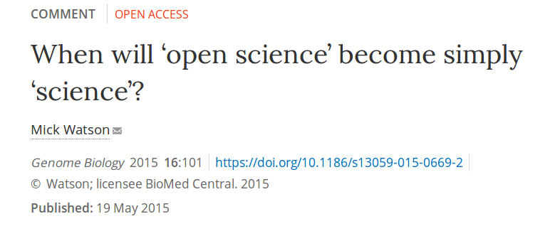

## An early career researcher's view on modern and open scholarship

```
Laurent Gatto                      Computational Proteomics Unit
https://lgatto.github.io           University of Cambridge
lg390@cam.ac.uk                    @lgatt0
```

* Slides: http://bit.ly/20170925OSevening
* Blog post: https://lgatto.github.io/EPFL-open-science/

## Licence

These slides are available under a creative common
[CC-BY license](http://creativecommons.org/licenses/by/4.0/). You are
free to share (copy and redistribute the material in any medium or
format) and adapt (remix, transform, and build upon the material) for
any purpose, even commercially.


## 

* Introduction
* What is open research
* Open vs close?
* Why isn't open?
* Go open!
* What can we do?
* What can institutions do?
* Inclusivity!
* Conclusions

## 

* Laurent Gatto: ECR, non-established research staff, PI
* Reproducible research, computational research, data, research
  software
* Open scholar, and convinved that open is a gateway to better
  research

## What is open research/science?

Any research output should be 

* free to access (read)
* free to use/re-use/mine
* free to disseminate (publish)

And

* inclusive

## Open is a gateway to more trustworthy research

- Open research is research that enables reproducible and repeatable
  research.
- Open research is transparent and honest research .
- Open research is research that we can build upon.

**Open is better, and we should always aim for the better, not the worse.**

## 

[](https://genomebiology.biomedcentral.com/articles/10.1186/s13059-015-0669-2)


## But then...

> Why wouldn't anyone want to do open research?

If *research is the by-product of researchers getting promoted* (David
Barron), then shouldn't we, early career researchers (ECRs), focus on
promotion and being docile academic citizens rather than aiming for
the more nobel cause of pursuing research to understand the world that
surrounds us, and disseminate our findings using modern channels?

## 

Barriers are not technological, but rather socio-cultural and
political.

- Sytemic control and inertia
- Vested interests by people in charge 
- Abuse of power dynamics
- (Preceived) fear of being scooped, or not being credited
- (Preceived) fear of errors and public humiliation, risk for reputation
- (Preceived) fear of information overload
- (Preceived) fear of becoming less competitive in a overcompetitive market!
- ...

## Go OPEN! 

Open science/research is particularly important for ERCs. Open
research practices are here, and won't go away. It is clear that they
will increase in the near future. If *you*, as an ECR, want to be a
competitive researcher in the coming years (and you'll need to be),
you'll need to be well versed in open research practices. 

## Incentives

* Funders' requirements: CC-BY Open access, research output management
  plans (data, software, antibodies, ...), Open data mandatory for H2020, ...
* Acceptance of open practice: pre-prints (WT, MRC, NIH).
* Open science evaluation criteria: EU's [Evaluation of Research Careers fully acknowledging Open Science Practice](https://cdn1.euraxess.org/sites/default/files/policy_library/os-rewards-wgreport-final_integrated_0.pdf) defines an Open Science Career Assessment Matrix.
* Open access and data availability lead to more citations.
* [Faculty promotion must assess reproducibility](https://www.nature.com/news/faculty-promotion-must-assess-reproducibility-1.22596)

## We still need more

But, let's face it, in practice, it is currently still relatively easy
to brush over many of these requirements. In addition, the incentives
are still inconsequential compared to the (perceived) risks. Maybe we
need more threads when not being open.

## What can we do as ECR?

* Build openness at the core your research
* Promoting open research through peer review: not data, no review
* [Five selfish reasons to work reproducibly](https://doi.org/10.1186/s13059-015-0850-7)
* Promoting open research/science: [No researcher is too junior to fix science](https://www.nature.com/news/no-researcher-is-too-junior-to-fix-science-1.21928)

## Institutions: the [BulliedIntoBadScience](http://bulliedintobadscience.org/) campaign

* Sign the Declaration on Research Assessment ([DORA](http://www.ascb.org/dora/))
* Positively value the commitment of open research and publishing practices
* Endorse immediate open publishing and 100% OA, and pre-prints
* Endorse, support and promote the open publication of data and other scientific outputs such as software.
* Educate researchers about publishing practices
* Be transparent about costs of publishing
* Make all ECRs full voting members of their institutions

## Inclusivity: open science and open science

<blockquote class="twitter-tweet" data-lang="en"><p lang="en"
dir="ltr">The primary value proposition of <a
href="https://twitter.com/hashtag/openscience?src=hash">#openscience</a>
is that diverse contributions allow better critique, refinement, and
application 3/n</p>&mdash; CⓐmeronNeylon (@CameronNeylon) <a
href="https://twitter.com/CameronNeylon/status/895546764861853696">August
10, 2017</a></blockquote> <script async
src="//platform.twitter.com/widgets.js" charset="utf-8"></script>

## Conclusions

* Open research is better research.
* There's more than one open.
* You want to do more. Yes please! 
